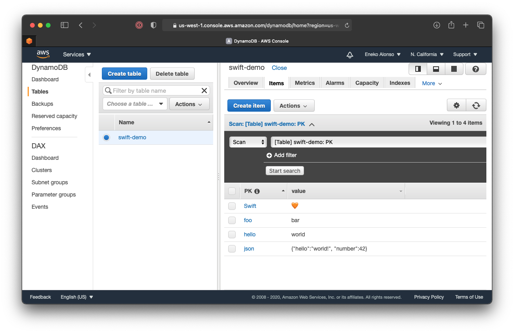

# dynamodb-demo

This repository contiains the source code for Using AWS DynamoDB from a Command Line Swift Application,
an article I wrote demonstrating how to write and read data to/from Amazon DynamoDB.

